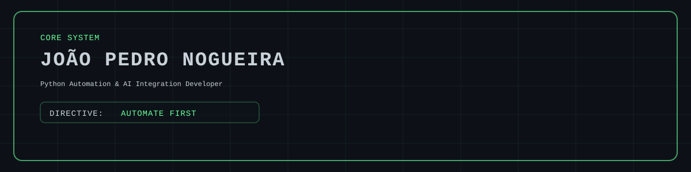

<p align="center">
  
</p>

<div align="center">

`STATUS: OPERATIONAL` · `MODE: AUTOMATE FIRST` · `CORE: PYTHON | AUTOMATION | DATA | WEB SYSTEMS`

</div>

## `> SYSTEM_PROFILE`

I am an **Automation & Data Developer** focused on process automation, data analysis, and internal systems. I turn manual operations into traceable workflows, web tools, and maintainable solutions built around real business needs.

My work connects Python development, reporting, business intelligence, and operational problem-solving. I am currently expanding this foundation with React and TypeScript to build more complete products from data processing to user interface.

```text
PRIMARY      Python automation and operational tooling
DATA         Analysis, consolidation, reporting, and BI
SYSTEMS      Internal applications, APIs, and workflow optimization
EXPANDING    React, TypeScript, and product-oriented web development
WORKFLOW     Git, branches, code review, and Pull Requests
```

## `> CORE_STACK`

**Automation & Backend**


**Data & Business Intelligence**


**Web & Collaboration**


`Also working with:` SQLite, Excel, Flask, PyQt5, Selenium, Playwright, n8n, discord.py, HTML, CSS, JavaScript, and Vite.

## `> FEATURED_BUILDS`

| Project | What it solves | Core technologies |
|---|---|---|
| **[DevTrack](https://github.com/jpzhum/devtrack)** | Organizes projects, tasks, and developer growth in a collaborative web platform. I contribute through technical mentoring, review, and project organization. | React, TypeScript, Vite, Git workflow |
| **[Nexa Adherence](https://github.com/jpzhum/nexa_adherence)** | Imports and consolidates operational data into a desktop workflow for analysis, filtering, reporting, and controlled exports. | Python, Pandas, PyQt5, SQLite, pytest, CI |

> Public projects are selected for relevance and verifiability. Internal work is described only by purpose and impact, without exposing proprietary information.

## `> FIELD_EXPERIENCE`

Working with process automation, data analysis, and operational tools in the sugar-energy industry.

- Develop and maintain automations that reduce repetitive manual work.
- Consolidate and validate data for dashboards, recurring reports, and operational analysis.
- Build tools that improve efficiency, traceability, and day-to-day decision support.
- Translate user and process needs into practical digital workflows.
- Maintain solutions in a real corporate environment while protecting internal data and context.

## `> CURRENT_OPERATION`

```text
[ACTIVE]  Evolving DevTrack through collaborative development and mentoring
[ACTIVE]  Maintaining a Discord community automation system in Python
[BUILD]   Creating Python automations and data-oriented operational tools
[LEARN]   Deepening React and TypeScript through practical projects
[IMPROVE] Architecture, testing, documentation, and maintainability
```

## `> DEVELOPMENT_PROTOCOL`

- Automate repetitive work when the process can be made safer and more traceable.
- Build around real operational needs and clear user outcomes.
- Use branches, focused commits, and Pull Requests for collaborative changes.
- Document decisions and favor maintainable solutions over quick fixes.
- Use AI as a development tool while keeping reasoning, validation, and responsibility human-led.
- Learn by building, reviewing, and improving working systems.

## `> CONNECTION`

[](https://github.com/jpzhum)
[](https://www.linkedin.com/in/jo%C3%A3o-pedro-nogueira-silva-82652b332/)

```text
REMOTE READY // OPEN TO COLLABORATION // AUTOMATE FIRST
```
